FIVESCUPは、S5Projectsが開催するCSGOの非営利コミュニティイベントです。  
日本に多数存在するコミュニティ同士の”壁”を取り払い、国内CSコミュニティの発展を目的に不定期で開催しています。  
[大会共通ルール](../rules/) 

## S5Worksが運営するイベントについて

### FIVESCUP OPEN

参加者がCS:GOをカジュアルに楽しむ事に重点を置いた、5v5のチーム対抗制のトーナメントイベントです。

### FIVESCUP CHALLENGE

競技マップを少数に絞り、対象のマップの習熟度を競う練習目的のトーナメントイベントです。

### FIVESCUP MixTournament

現役の高いスキルを持つ招待プレイヤーと、一般公募から参加するプレイヤーの混合チームで行いプレイヤー同士の交流・一般プレイヤーの競技シーンへの流入を目的としたトーナメントイベントです。

### FIVESCUP CONNECT

オフライン会場にて、一般公募からのプレイヤーの混合チームで行う交流イベントです。

### FIVESCUP BEGINNING

一般的なトーナメントフォーマットを採用し、16~64チームが競技的なルールで戦い合うより競技度が高いトーナメントイベントです。

## これまでの大会

### 2017.07.02 “[FIVESCUP Open Season1](https://web.archive.org/web/20221004170733/https://fivescup.jp/?p=661)“

優勝:”**Fantastic4**“　aritamikao,anders,gida,meru\*,pika

### 2017.09.02 “[FIVESCUP BEGINNING Season1](https://web.archive.org/web/20221004170733/https://fivescup.jp/?p=715)“

優勝:”**OUTLANDISH**“　abnormaL,hippy,Naokich1,syunG,volwie

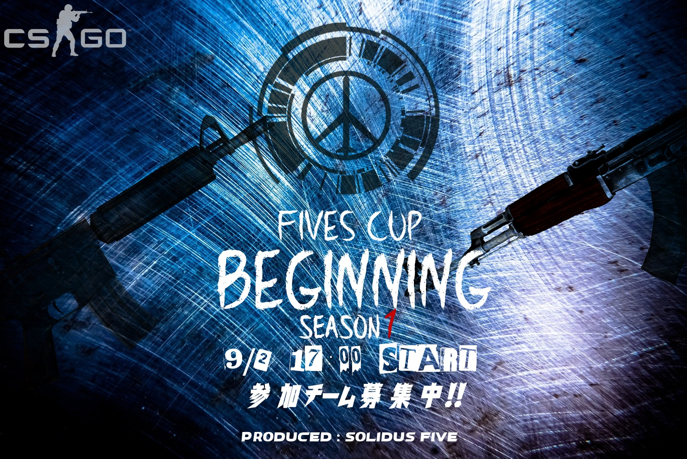

### 2017.10.08 “[FIVESCUP BEGINNING Season2](https://web.archive.org/web/20221004170733/https://fivescup.jp/?p=1109)“

優勝:”**HCBC**“　Colonadot Stingray,NETHydra,meteorolestreamⅣ,OZ,tmg

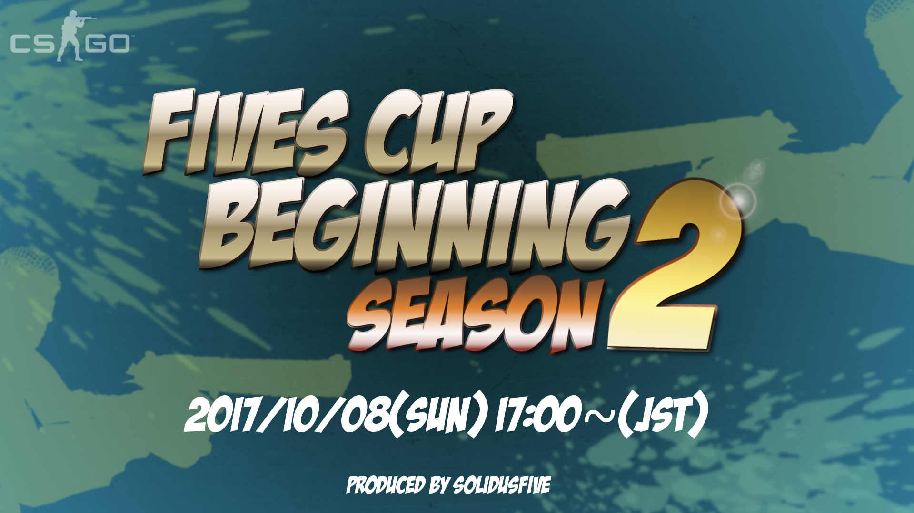

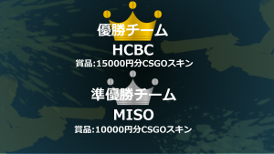

### 2017.10.15 “[FIVESCUP Dust2王者決定戦](https://web.archive.org/web/20221004170733/https://fivescup.jp/?p=1193)“

優勝: “**MIXO**” tsubaki,RIPablo Escobar,kuririn,M4sh,HiRoKz,TOSUKUi,공생

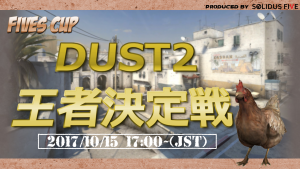

### 2017.11.05 “[FIVESCUP BEGINNING Season3](https://web.archive.org/web/20221004170733/https://fivescup.jp/?p=1562)“

優勝: “**Ignis 2nd**” NETHydra,Ayanoxie,ATR-,Hornet,guin

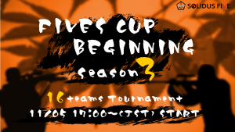

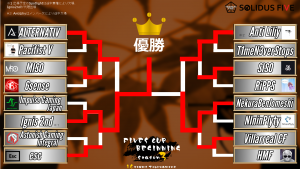

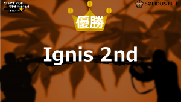

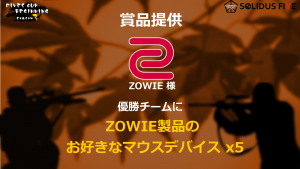

### 2017.11.26 “[FIVESCUP Mix Tournament Season1](https://web.archive.org/web/20221004170733/https://fivescup.jp/?p=1709)“

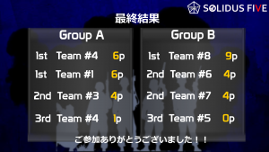

—Group1—  
Team#4 : 6pt,Team#1 : 6pt,Team#3 : 4pt,Team#2 : 1pt

—Group2—  
Team#8 : 9pt,Team#7 : 4pt,,Team#6 : 4pt,Team#5 : 0pt

### 2018.03.10 “[FIVESCUP Challenge Season1](https://web.archive.org/web/20221004170733/https://fivescup.jp/?p=1962)“

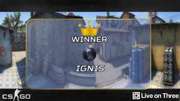

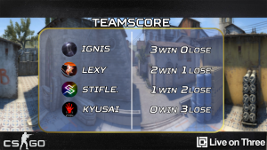

1st : _**Ignis**_ 3W 0L  
2nd : LeXy  
3rd : Stifle.  
4th : KYUSAI

### 2018.04.21 “[FIVESCUP 2v2 RetakeMasters Season1](https://web.archive.org/web/20221004170733/https://fivescup.jp/2v2-s1-result/)“

| 優勝 | Ignis (賞品: 1,000円相当の武器スキン) |
| --- | --- |
| 準優勝 | 生まれたての小さいおじさんたち |

### 2018.04.28 “[FIVESCUP Challenge Season2](https://web.archive.org/web/20221004170733/https://fivescup.jp/?p=1962)

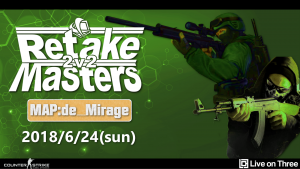

| 優勝 | \-Noir et blanc (賞品: 1,000円相当の武器スキン + 鍵5個) |
| --- | --- |
| 準優勝 | Ignis |

### 2018.06.09 “[FIVESCUP 2v2RetakeMasters Season2](https://web.archive.org/web/20221004170733/https://fivescup.jp/2v2-s2-result/)

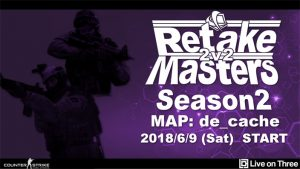

| 優勝 | Ignis |
| --- | --- |
| 準優勝 | ドスコイJAPAN |

### 2018.06.24 “[FIVESCUP 2v2RetakeMasters Season3](https://web.archive.org/web/20221004170733/https://fivescup.jp/2v2-s3/)

### 2018.12.16 “[FIVESCUP Challenge Season3](https://web.archive.org/web/20221004170733/https://fivescup.jp/post-2536/)

| 優勝 | team baiter |
| --- | --- |
| 準優勝 | Moai meister |

### 2019.03.21 “[FIVESCUP Beginning Season4](https://web.archive.org/web/20221004170733/https://fivescup.jp/post-2579/)

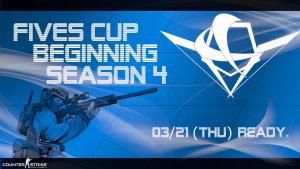

| 優勝 | Ignis |
| --- | --- |
| 準優勝 | SCARZ |

### 2019.08.03 “[FIVESCUP CONNECT Vol.1](https://web.archive.org/web/20221004170733/https://fivescup.jp/connect-vol1-result/)

  
TeamA 16 – 12 TeamB  
TeamB 16 – 9 TeamC  
TeamC 16 – 11 TeamA  
DangerZone Game1 – Sirocco : 一位 : yue  
DangerZone Game2 – Blacksite : 一位 : Juice
