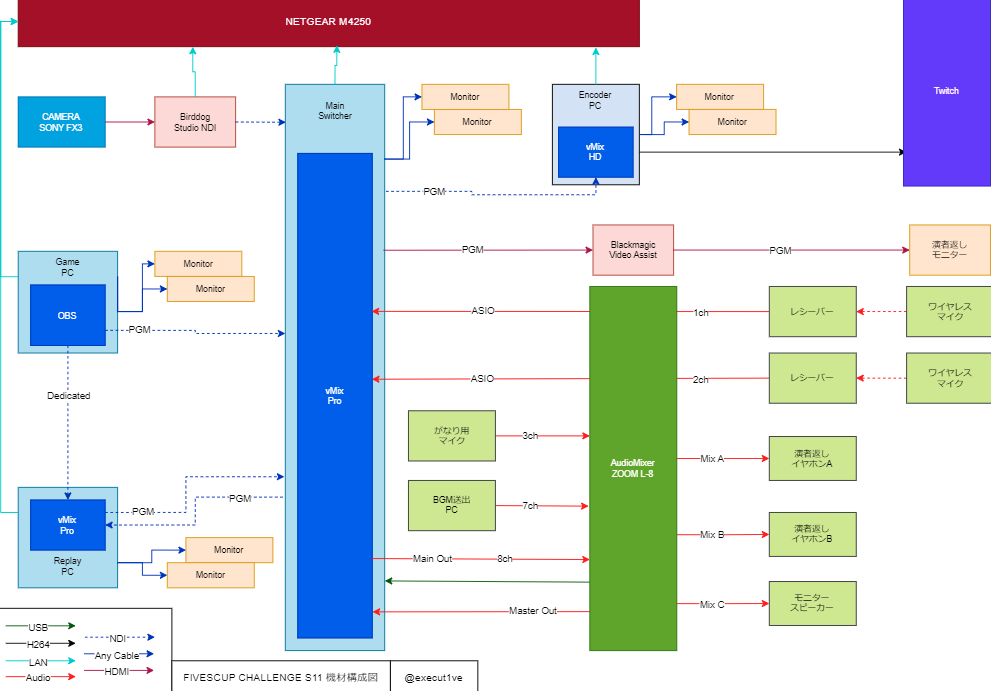

注意: 本記事は技術関連記事です。

FIVESCUP CHALLENGE SEASON11や、S5 Worksの活動自体にはあまり関係がありません。

機材構成図

本日の機材構成図です。　映像伝送は主にNDIを採用し、スイッチャーはvMixで統一しました。  
NDIの疎通にはNETGEAR M4250を使用し、NDIに特化した専用のネットワークを構築する事でスムーズな映像伝送を実現しました。  
しかしながら、エンコーダーPCとNDIの相性が悪く、映像にラグが発生したためメインスイッチャー機よりエンコーダーPCのみBlackMagicDesign Video Assist 12G 5inchを使用してキャプチャーをしましたが、途中で音声に問題が発生したためElgato HD60SのHDMI接続に変更しました。

音声関連は特別なことはしておらず、アナログ接続で行いました。  
メインのオペ卓には ZOOM L-8 Live Talkを採用しましたが、返す系統単位でフェーダーを制御でき、必要な音量を演者に届けることが実現出来た為、今回の構成ではとても相性が良かったです。  
しかしながら、S5 Works自体が音響に対する知識が浅いため、音のポンだしやBGM制御には難儀しました。  
CSGOのイベント制作に興味がある方、音響の知識がある方は是非管理人までご連絡くださいませ。

サーバーの管理には、これまで使っていたサーバー管理システム"Project Hypnos"をカスタムして使用しましたが、初戦にバグが発生し、スムーズな大会進行を妨げる結果となりました。  
参加者の皆様には、お詫び申し上げます。  
今回に得た情報を使い、次回以降のイベントでは自動化されたスムーズなイベント進行を行えるべく努力してまいります。

今回の機材構成を実現するにあたり、Mohimohiサーバー様より様々な機材をご提供いただきました。  
S5 Worksの活動継続には、Mohimohiサーバーの皆様の協力が不可欠でした。  
本当にありがとうございました。

また、急遽の声掛けに応じてスタジオで尽力いただいたスタッフの皆様、そしてオンラインでサポート頂いた皆様には感謝しております。本当にありがとうございます。皆さんのお陰です。

また次の大会で、新しい技術を披露出来ることを楽しみにしています。  
それでは、また。

S5 Works 代表 Shugo "FlowingSPDG" Kawamura
