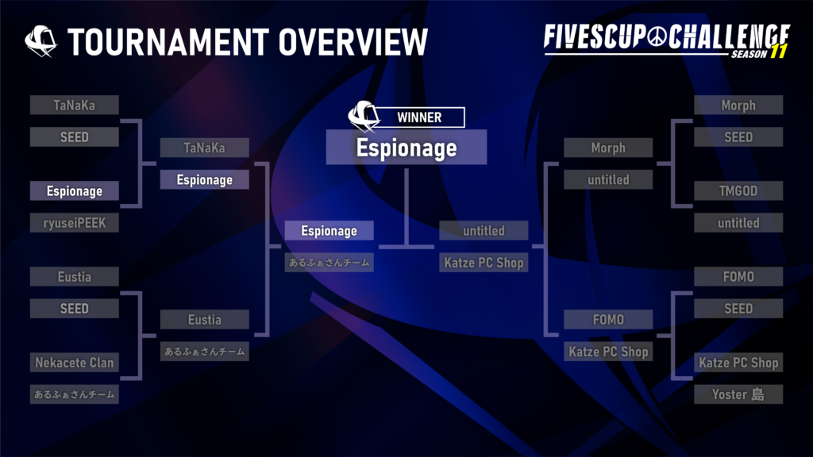

2023年4月2日に、**FIVESCUP CHALLENGE: SEASON11**を開催し、**Espionage** が優勝となりました。

## FIVESCUP CHALLENGE SEASON11

**FIVESCUP CHALLENGE**は、7つある競技マップを少数に絞り、そのマップの習熟度を競うことをコンセプトとした、5v5の大会です。

### 結果

| 優勝 | Espionage |
| --- | --- |
| 準優勝 | untitled |

#### 決勝戦

- Espionage\[16\] - \[11\]untitled (de\_cache)

#### 参加チーム

- **あるふぁさんチーム**

- **TaNaKa**

- **Morph**

- **Katze PC Shop**

- **Espionage**

- **TMGOD**

- **Yostar島**

- **Eustia**

- **untitled**

- **ryuseiPEEK**

- **FOMO**

- **nekacete Clan**

### ストリーミング配信録画

[https://www.twitch.tv/videos/1782634876](https://www.twitch.tv/videos/1782634876)

### FIVESCUPとは？

**FIVESCUP** はS5Works主催する **Counter-Strikeシリーズ** のオンライン大会です。国内競技シーン発展のため、誰でも気軽にCS:GOの競技的側面を楽しんでいただけるような大会・イベントを企画運営しています。
