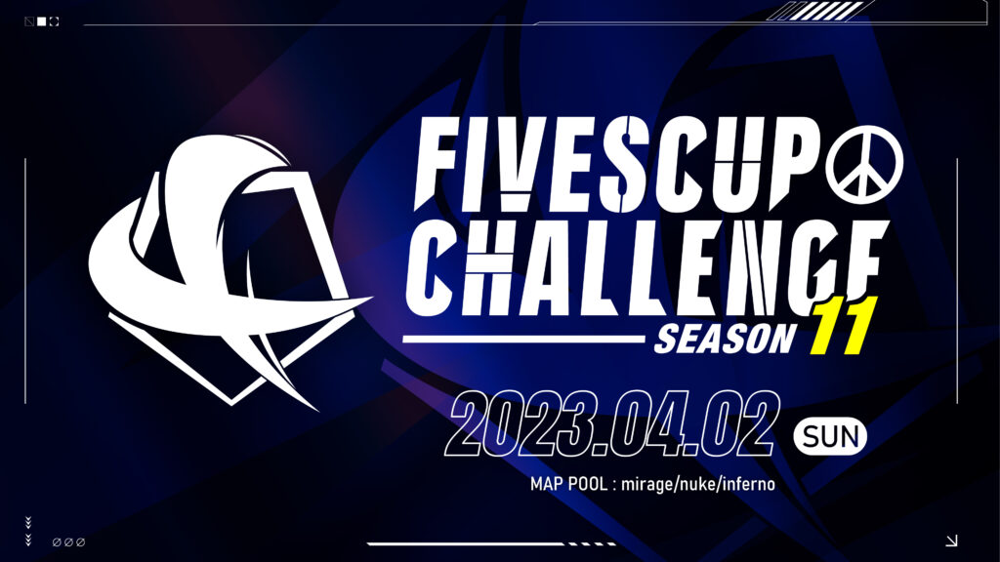

2023年4月2日に、**FIVESCUP CHALLENGE SEASON11**を開催します。

**FIVESCUP CHALLENGE**は、7つある競技マップを少数に絞り、そのマップの習熟度を競うことをコンセプトとした5v5の大会です。

## FIVESCUP CHALLENGE: SEASON11

| 大会名 | FIVESCUP CHALLENGE: SEASON11 |
| --- | --- |
| 対戦形式 | トーナメント戦 |
| フォーマット | Best of 1. |
| SEASON10 MAP POOL | Nuke / Mirage/ Inferno |
| 開催日程 | 2023年 04月02日(日) |
| 最大チーム数 | 16チーム |
| ルール | [大会共通ルール](/rules/) |

### 賞品

未定

### 参加登録方法

[Google Form](https://forms.gle/Ng3gpG4Mk41JioUD6)から参加表明を行って下さい。

### 大会進行

**[FIVESCUP Discord](https://web.archive.org/web/20220814042824/https://discord.gg/Uh7qQcp)** にて行います。

#### スケジュール

スケジュールは予期せず変更される場合があります。

<figure>

| 15:00 | チェックイン開始 |
| --- | --- |
| 15:30 | チェックイン締切 |
| 15:40 | トーナメント発表 |
| 15:45 | トーナメント 第1試合 |
| 17:00 | トーナメント 第2試合 |
| 18:00 | トーナメント 第3試合 |
| 19:00 | 準決勝 |
| 21:00 | 決勝 |

<figcaption>

試合間のインターバルは、両チームの合意があればスキップ出来るものとします。

</figcaption>

</figure>

### FIVESCUPとは？

**FIVESCUP** はS5 Worksが運営・主催する **Counter-Strike** シリーズ のオンライン大会です。コミュニティを重視した大会を目指しています。
