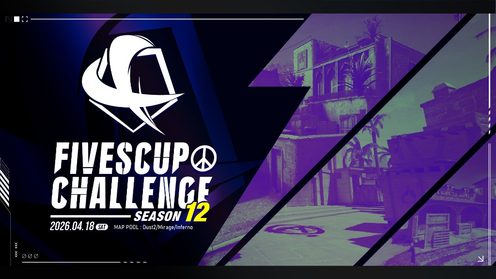

**2026年4月18日（土）** に **FIVESCUP CHALLENGE: SEASON12** を開催し、**Ataks** が優勝となりました。

開催概要・マッププールなどは **[SEASON12 大会情報](../fivescup-challenge-season12/)** をご覧ください。

## FIVESCUP CHALLENGE SEASON12

**FIVESCUP CHALLENGE** は、7つある競技マップを少数に絞り、そのマップの習熟度を競うことをコンセプトとした 5vs5 の大会です。

### 結果

| 順位 | チーム名 |
| --- | --- |
| 1位 🏆 | Ataks |
| 2位（準優勝） | EXCIDIUM |

### トーナメント表（Challonge）

<iframe src="https://challonge.com/ja/challenge_season12_2026_04_18_0600/module" title="FIVESCUP CHALLENGE SEASON12 トーナメント" width="100%" height="500" frameborder="0" scrolling="auto" allowtransparency="true"></iframe>

[Challonge で開く](https://challonge.com/ja/challenge_season12_2026_04_18_0600)

### FIVESCUPとは？

**FIVESCUP** は S5 Works が運営・主催する **Counter-Strike 2（CS2）** シリーズのオンライン大会です。コミュニティを重視した大会を目指しています。
