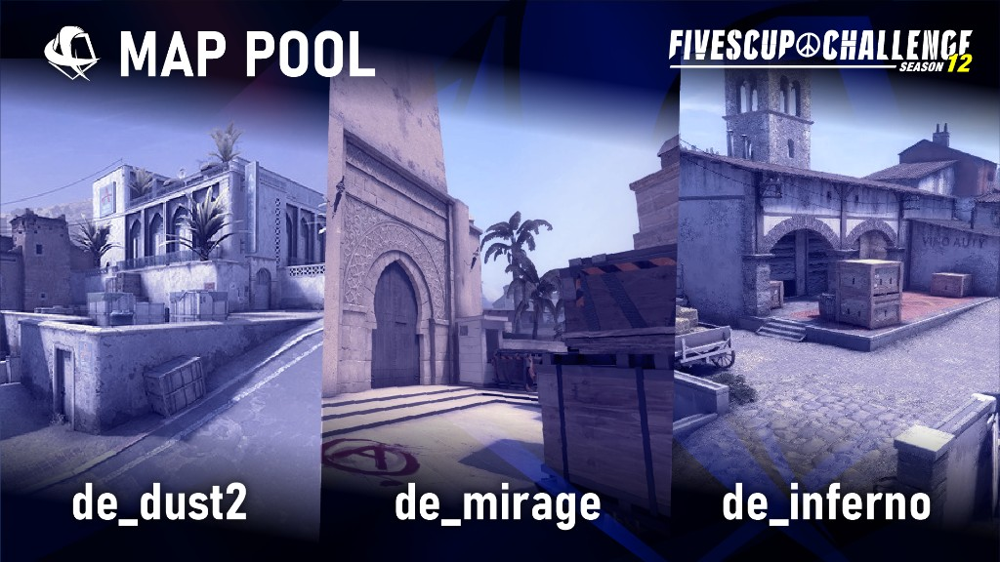

**2026年4月18日（土）** に **FIVESCUP CHALLENGE SEASON12** を開催します。参加・当日の案内は **[FIVESCUP Discord](https://discord.gg/cEdTyhVRyq)** で行います。

**FIVESCUP CHALLENGE** は、7つある競技マップを少数に絞り、そのマップの習熟度を競うことをコンセプトとした 5vs5 の大会です。

## FIVESCUP CHALLENGE: SEASON12

| 項目 | 内容 |
| --- | --- |
| 大会名 | FIVESCUP CHALLENGE: SEASON12 |
| 対戦形式 | トーナメント戦 |
| フォーマット | Best of 1 |
| MAP POOL | **Dust2 / Mirage / Inferno** |
| 開催日程 | **2026年4月18日（土）** |
| 最大チーム数 | 16チーム（変更の場合はお知らせします） |
| ルール | [大会共通ルール](../../rules/) |

### 賞品

未定

### 参加登録方法

**[FIVESCUP Discord](https://discord.gg/cEdTyhVRyq)** にて参加表明・受付の案内を行います。Google フォームは使用しません。

### 大会進行

**[FIVESCUP Discord](https://discord.gg/cEdTyhVRyq)** にて行います。

#### スケジュール（目安）

変更がある場合は Discord でお知らせします。参考までに、直近の [SEASON11](../fivescup-challenge-season11/) に近い進行の目安です。

| 時刻（目安） | 内容 |
| --- | --- |
| 15:00 | チェックイン開始 |
| 15:30 | チェックイン締切 |
| 15:40 | トーナメント発表 |
| 15:45 | トーナメント 第1試合 |
| 17:00 | トーナメント 第2試合 |
| 18:00 | トーナメント 第3試合 |
| 19:00 | 準決勝 |
| 21:00 | 決勝 |

試合間のインターバルは、両チームの合意があればスキップできるものとします。

### スタッフ

| 役割 | 担当 |
| --- | --- |
| Director/Developer | Flowing（X: [@flowingspdg](https://x.com/flowingspdg)） |
| Server Sponsor | execut1ve（X: [@execut1ve](https://x.com/execut1ve)） |
| Design | GuleruuN（X: [@guleruun](https://x.com/guleruun)） |

### FIVESCUPとは？

**FIVESCUP** は S5 Works が運営・主催する **Counter-Strike 2（CS2）** シリーズのオンライン大会です。コミュニティを重視した大会を目指しています。
