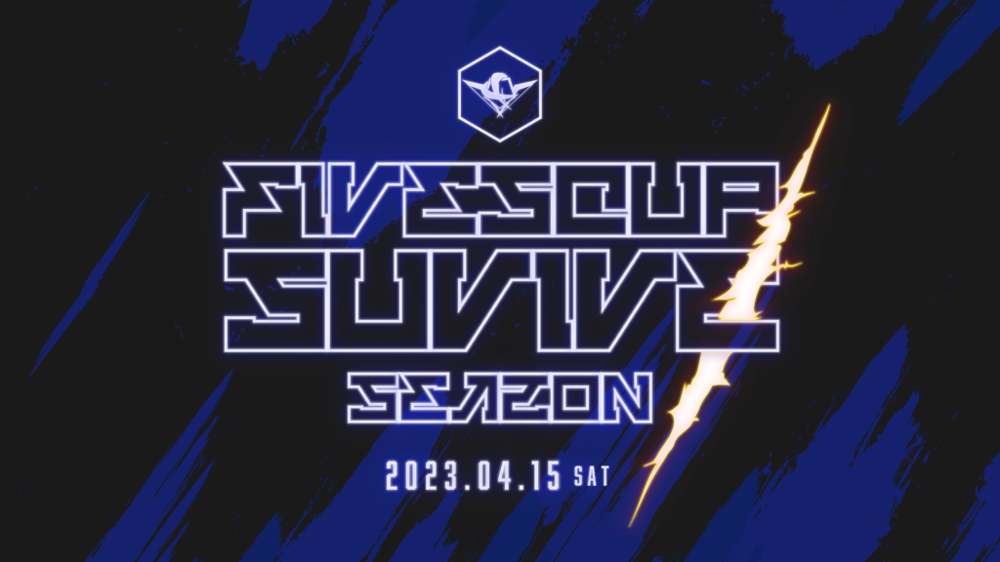

2023年4月15日に、**FIVESCUP SURVIVE SEASON1**を開催します。

**FIVESCUP SURVIVE**は、競技モードではないバトルロワイヤルモード"Danger Zone"を採用したカジュアルなCSGOのイベントです。

## FIVESCUP SURVIVE: SEASON1

| 大会名 | FIVESCUP SURVIVE: SEASON1 |
| --- | --- |
| 対戦形式 | 4MAP ポイント制 |
| SEASON1 MAP POOL | Blacksite / Sirocco/ Ember / Vineyard |
| 開催日程 | 2023年 04月15日(土) |
| 最大チーム数 | 8チーム(16名) |

### 参加登録方法

[Google Form](https://forms.gle/XT8SAQb4HvWCYcXr8)から参加表明を行って下さい。

### 大会進行

**[FIVESCUP Discord](https://discord.gg/Uh7qQcp)** にて行います。

#### スケジュール

スケジュールは予期せず変更される場合があります。

| 15:00 | チェックイン開始 |
| --- | --- |
| 15:30 | チェックイン締切 |
| 16:00 | 第1試合 Blacksite |
| 16:30 | 第2試合 Sirocco |
| 17:00 | 第3試合 Ember |
| 17:30 | 第4試合 Vineyard |

### FIVESCUPとは？

**FIVESCUP** はS5 Worksが運営・主催する **Counter-Strike** シリーズ のオンライン大会です。コミュニティを重視した大会を目指しています。
